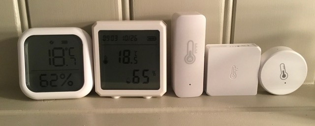
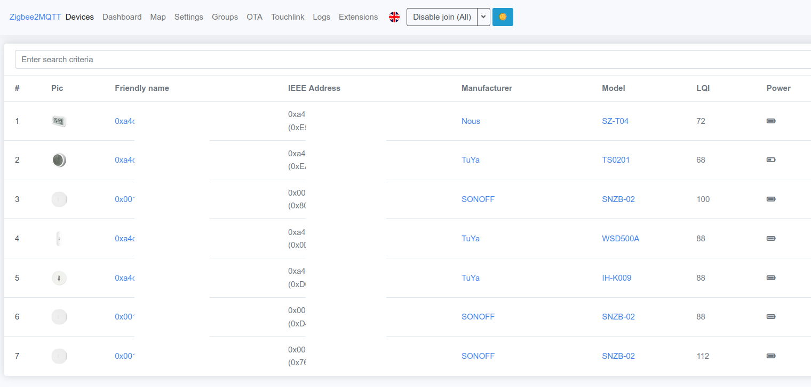
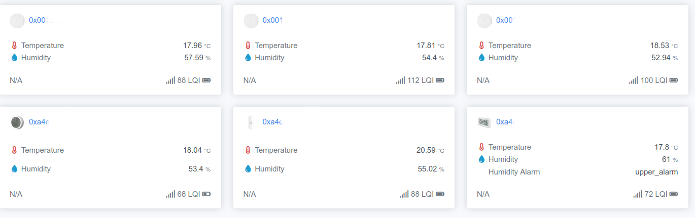
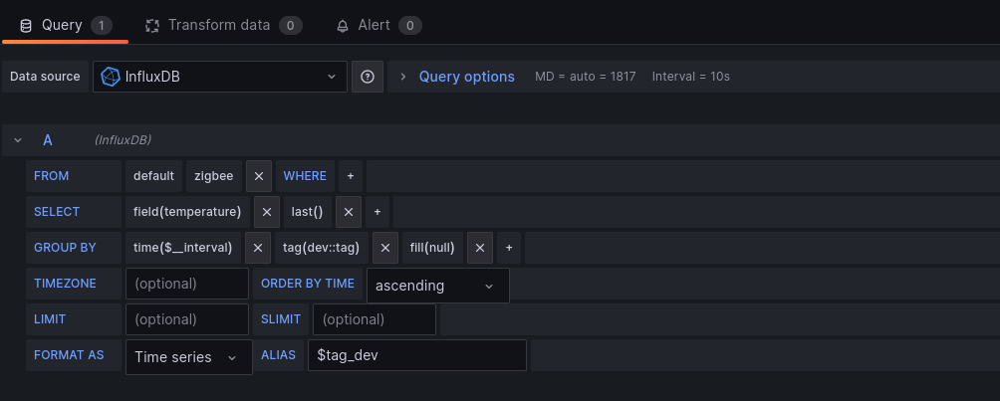
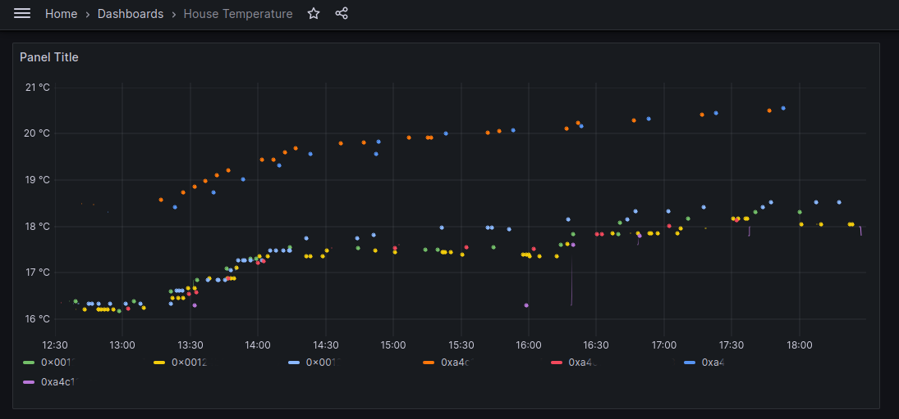
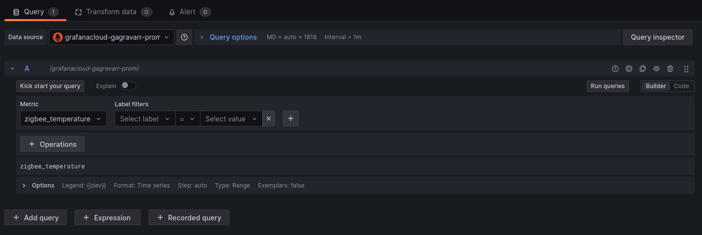
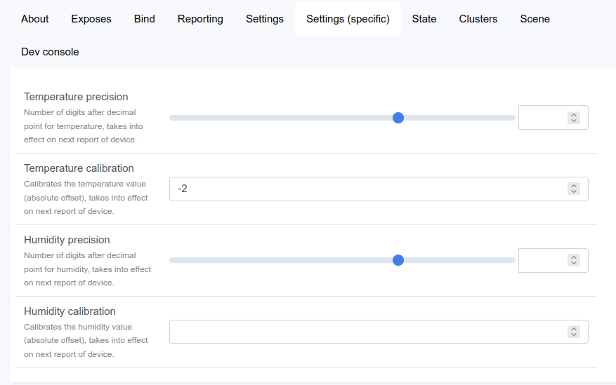

# Home Temperature Monitoring with Zigbee devices
## (But not much else in the way of home automation)
### For Ubuntu 23.10 (Likely similar for other platforms/releases)

Assuming you don't want to go all-in on one of the propriatary home automation
solutions, you have two broad options. One is to use an open source home
automation system, such as [Home Assistant](https://www.home-assistant.io/) or
[OpenHab](https://www.openhab.org/). The other is to use something more 
low-level to communicate with your zigbee devices, and glue it all together 
yourself.

Since I (currently) only want to monitor and graph the temperature in my 
house, and don't need any actions taken with it, that's the route I opted
for. The key bit of open source software I'm using is
[Zigbee2MQTT](https://www.zigbee2mqtt.io/)

## Broad Approach

1. Temperature sensors send readings periodically, over zigbee
1. Zigbee2MQTT processes sensor message, forwards to MQTT queue
1. ???
1. Graphs drawn

Since most graphing tools want to be able to see values over a period of
time, and simpler MQTT setups don't retain messages that have been read,
we either need one of:

1. Stream processing system like Flink or Pulsar
1. Retain all messages in the queue, re-stream them every graph re-draw
1. Send MQTT messages into an IoT or Time-Series database, graph from that

I want to use [Grafana](https://grafana.com/) to draw the graphs. I found
a bunch of tutorials for [InfluxDB](https://www.influxdata.com/products/influxdb-overview/) 
to learn from / steal ideas from, so I opted for that. To sit between the
MQTT queues and InfluxDB, I wet for 
[Influx's Telegraf](https://github.com/influxdata/telegraf). That makes
our approach:

1. Temperature sensors send readings periodically, over zigbee
1. Zigbee2MQTT processes sensor message, forwards to MQTT queue
1. Telegraf reads messages from MQTT and forwards to InfluxDB
1. InfluxDB holds time series data, doing aggregation and sampling
1. Grafana querys InfluxDB then draws graphs 

## Buying some Zigbee temperature sensors

I ordered a bunch of different ones from different manufacturors. All at the 
cheaper end of pricing! So far, none of them are amazing, and none are 
terrible. Plenty of comparisons and reviews exist online!

Most needed some level of calibration, see the [calibration 
section](#Calibrating) later for more on that.



## Buying a Zigbee adapter

Based on instructions like [Flashing the CC2531 USB stick (Zigbee2MQTT)](https://www.zigbee2mqtt.io/guide/adapters/flashing/flashing_the_cc2531.html),
I decided against getting one of the cheaper adapters that might need 
flashing / reflashing with appropriate firmware. Based on the
[Zigbee2MQTT recommended adapters list](https://www.zigbee2mqtt.io/guide/adapters/#recommended)
and some forum posts, I went for a *Sonoff Zigbee 3.0 USB Dongle PLus - 
ZBDongle-E*, which seems to be working very well.

## MQTT Broker

As the name suggests, Zigbee2MQTT will output messages to an MQTT message
broker. A lot of tutorials suggest [Mosquitto from Eclipse](https://mosquitto.org/)
which is packaged for Ubuntu, so I went with that.

```
sudo apt-get install mosquitto mosquitto-clients
sudo systemctl enable mosquitto
sudo systemctl start mosquitto
```

## Zigbee2MQTT

Zigbee2MQTT is written in Node.js. If you're happy with `node` and `npm`, 
follow the [Zigbee2MQTT installation guide for Linux](https://www.zigbee2mqtt.io/guide/installation/01_linux.html).
If not, the pre-built Docker images may be a lot easier. See the
[Zigbee2MQTT installation guide for running on Docker](https://www.zigbee2mqtt.io/guide/installation/02_docker.html),
and remember to expose your Zigbee adapter to Docker!

Once running, access the web interface at http://localhost:8080/

## Pair some devices
Make sure your Zigbee2MQTT configuration has

```permit_join: true```

Then, for each temperature device, trigger pairing. (Often that means holding down a button
for 5 seconds, or pushing a pin into the reset button hole for 5 seconds).

You should see the devices pair and be configured in the Zigbee2MQTT web interace. It can
take a little while for them to fully show up, don't be worried if they appear as an
unknown device briefly!

## Testing that it's working so far

To test that Zigbee2MQTT is working, head to the web interface at 
http://localhost:8080/ , check that your devices are showing up, and have 
temperatures showing.

It should look something like:


Next, verify that the Mosquitto MQTT server is working, and that updates from 
the zigbee devices are being passed through. Connect to mosquitto to the special
"all-topics topic" `#` with

```mosquitto_sub -h localhost -t "#" -v```

You should immediately see updates from Zigbee2MQTT itself, on topics with the
`zigbee2mqtt/bridge/` prefix. Whenever a device sends an update, you should see
those under `zigbee2mqtt/0x(address)`. (You probably want to rename them in the
web interface later).

You can also then see a dashboard in Zigbee2MQTT showing an overview of all
your devices and their temperatures:


## Using Telegraf to bridge from MQTT to InfluxDB

Note - the latest InfluxDB packaged for Ubuntu 23.10 is still the 1.x family, 
which lacks the web interface and other new features of the 2.x releases. You
also need to configure Telegraf differently for InfluxDB 1.x and 2.x, so take
care when following tutorials that you're using instructions for the version
you're using!

These steps assuming you're using the InfluxDB v1.x that is packaged by 
Ubuntu. If you want 2.x you may want to [manually install the latest
version](https://docs.influxdata.com/influxdb/v2/install/?t=Linux) (it's only
a handful of files), or [run the Docker version](https://docs.influxdata.com/influxdb/v2/install/?t=Docker)

### Install Telegraf
```apt-get telegraf```

The default Telegraf configuration includes a lot of inputs about the host
system that you probably don't want for Zigbee temperature monitoring. 
You should disable most/all of these. Potentially even zap most of the
`/etc/telegraf/telegraf.conf` file after the `[agent]` section. Then, 
create `/etc/telegraf/telegraf.d/zigbee.conf` with following:

```
# Read Zigbee sensor data from MQTT
[[inputs.mqtt_consumer]]
  servers = ["tcp://localhost:1883"]
  topics = ["zigbee2mqtt/#"]
  data_format = "json"
  # Use the name of the sensor for the "tag"
  name_override = "zigbee"
  topic_tag = "dev"
 
# Strip the base topic (typically "zigbee2mqtt") 
# from the dev tag using the regex processor
[[processors.regex]]
  namepass = ["zigbee"]
 
  [[processors.regex.tags]]
    key = "dev"
    pattern = '^zigbee2mqtt/(?P<device>.+)$'
    replacement = "${device}"

# Don't include messages about the Zigbee2MQTT bridge itself
# (also note the single square brackets used for this)
[inputs.mqtt_consumer.tagdrop]
  dev = ["zigbee2mqtt/bridge/*"]

# Send to Influx v1
[[outputs.influxdb]]
  urls = ["http://127.0.0.1:8086"]
  namepass = ["zigbee"]
  database = "zigbee"
  skip_database_creation = false
```

If you want to test Telegraf at this stage, comment out the
`[[outputs.influxdb]]` section, add in this test output:
```
# Print to stdout for debugging
# Disable this once you're happy everything works!
[[outputs.file]]
  files = ["stdout"]
  data_format = "json"
```
Then run telegraf with 
`telegraf --config /etc/telegraf/telegraf.conf --config-directory /etc/telegraf/telegraf.d/`
 . It may take a few minutes to see anything reported, depending on how
often your zigbee devices report in.

### Install InfluxDB 1.x
```
apt-get install influxdb influxdb-client
systemctl enable influxdb
systemctl start influxdb
```

### Enable Telegraf (once InfluxDB is running for it to talk to)
```
systemctl enable telegraf
systemctl start telegraf
```

### Confirm Telegraf is feeding InfluxDB
Connect to your local InfluxDB server with the `influx` client.

Do a `show databases` and ensure that the `zigbee` one is shown
(normally at this stage you'll have `zigbee` and `internal`)

Do a `show series on zigbee` and ensure that (after a few minutes)
all your zigbee devices show up as their own series.

## Grafana stuff
### Grafana Cloud
Grafana offer a free cloud hosted version.

It is possible to have Telegraf feed data to a cloud-hosted Grafana
via the [Grafana Cloud Prometheus server and the Influx compatible
endpoint](https://grafana.com/docs/grafana-cloud/send-data/metrics/metrics-influxdb/push-from-telegraf/).

Make sure that you create a write access token, not a read access
token, when setting the token up from your Prometheus hosted metrics
page! Your telegraf config will want to be something like
```
[[outputs.influxdb]]
  urls = ["https://influx-prod-ZZ-prod-eu-west-2.grafana.net/api/v1/push/influx"]
  namepass = ["zigbee"]
  database = "telegraf_metrics"
  skip_database_creation = true
  user_agent = "telegraf"
  username = "1234567"
  password = "glc_abcdefg="
```

### Grafana Docker
Follow the [Grafana Docker setup/install guide](https://grafana.com/docs/grafana/latest/setup-grafana/installation/docker/)

Be sure to provide a Docker Volume or a Bind Mount, so that your dashboards
and settings aren't lost when pods are recreated!

### Grafana Packages for Ubuntu
Grafana isn't packaged by Canonical for Ubuntu, so you'll have to add the
Grafana apt repo before you can install. Full details of the steps to add
that and install Grafana on their
[Ubuntu + Debian setup/install guide](https://grafana.com/docs/grafana/latest/setup-grafana/installation/debian/)

### Graphing temperatures with Grafana
You first need to add an 
[InfluxDB data source](https://grafana.com/docs/grafana/latest/datasources/influxdb/)
pointing to your InfluxDB database into to Grafana, before you can start 
drawing graphs. 

Head to
http://localhost:3000/connections/add-new-connection

*TODO rest*





Note that query is slightly different if you're using the Grafana Cloud 
version, as for that you'll be querying Prometheus not InfluxDB


## Calibrating
Many of the cheaper sensors have "not-great" temperature sensor chips inside them.

For a good overview of what chips you should prefer, and why, see
 * https://randomnerdtutorials.com/dht11-vs-dht22-vs-lm35-vs-ds18b20-vs-bme280-vs-bmp180/
 * https://forum.arduino.cc/t/compare-different-i2c-temperature-and-humidity-sensors-sht2x-sht3x-sht85/599609/12
 * https://www.kandrsmith.org/RJS/Misc/hygrometers.html
 * https://www.kandrsmith.org/RJS/Misc/Hygrometers/calib_many.html
 * https://home-assistant-guide.com/guide/the-best-temperature-and-humidity-sensor-for-esphome/

For example, based on information from the [hackaday custom firmware for
SNZB-02](https://hackaday.io/project/187193-sonoff-snzb-02-diy), we can see 
that the Sonoff SNZB-02 has the HDC1080 sensor. This is generally fairly well
regarded, but not the best possible. So, you may find you need to calibrate
the sensors.

To calibrate humiditity, the easiest way is to put the sensor in an 
environment of known humidity, then tweak the value as required for it
to read correctly. The "easiest" way for most people at home to do that
is a saturated salt box. See
[robertoostenveld.nl/sonoff-snzb02/](https://robertoostenveld.nl/sonoff-snzb02/)
for details and instructions.

Once you have identified how much of a change your sensor needs, in absolute
terms (eg -0.5 degrees C, +5% humidity), in Zigbee2MQTT go to the 
`Settings (specific)` tab for the device. Enter the calibration offsets
required into the temperature and/or humidity boxes. Values are auto-saved,
but won't apply to previous readings, only new ones.



## Threads
https://social.earth.li/notice/Ab9larIg8eGJbapInI
